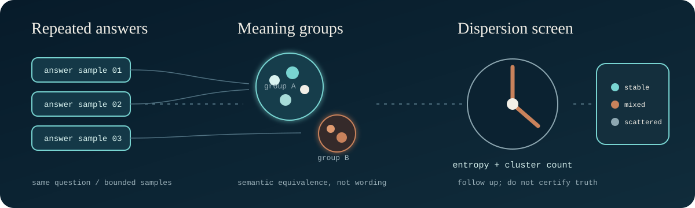

# semantic-entropy

[](https://github.com/regsaddler/semantic-entropy/actions/workflows/self-test.yml)

<p align="center">
  
</p>

A zero-dependency, local-hardware answer-stability screen. It asks a model the same question several times; it clusters the answers by meaning; it measures how widely the meanings scatter. Tight cluster: the model keeps saying the same thing. Wide scatter: the answer is unstable, and an unstable answer is a poor thing to act on. Consistency does not establish truth.

The method is from the published literature (Kuhn et al. 2023; Farquhar et al., Nature 2024), and the comparative claims are theirs. This repository contributes a pure-Python, stdlib-only implementation that runs against any OpenAI-compatible endpoint at zero API cost on local models. It also contributes something rarer: the receipts from our own attempt to extend the method, an attempt that failed.

## The failure, up front

We built a v0.2 extension (paraphrase and cross-family axes), pre-registered its pass/fail criteria before writing a line of code, and ran it once. It failed. Measured improvement over v0.1 was zero, because local model families share training cutoffs and agreed on the one genuinely stale fact in the probe set. We kept v0.1 and recorded the failure instead of tuning until it passed. The pre-registration and verdict are in `receipts/`, dated before the build and unchanged apart from marked redactions of internal identifiers. If you only read one file here, read that one. It is the point of the project: claims require evidence, and a detector that cannot survive its own falsifier should say so in its docstring. Ours does.

## Quickstart

Point `SE_ENDPOINT` at any OpenAI-compatible `/v1` (LM Studio, Ollama with the OpenAI shim, vLLM, or a hosted endpoint):

```
export SE_ENDPOINT="http://127.0.0.1:1234/v1"
python3 semantic_entropy.py --question "What is the capital of Australia?"
python3 semantic_entropy.py --question "What did the 1962 Brookfield Accord establish?" --json
```

The first question should come back `STABLE` with low entropy. The second is an invented premise; a well-behaved run shows the scatter, and the verdict says so instead of picking a favorite hallucination. Run the test suite with `python3 semantic_entropy.py --self-test` (45 checks, no network needed).

Endpoint responses are bounded at 8 MiB, redirects are refused, and
`SE_ENDPOINT` must be an explicit `http` or `https` URL without embedded
credentials, query parameters, or fragments. These checks limit accidental
resource use and credential forwarding; they do not make an untrusted model
server safe. Keep local endpoints on loopback unless you deliberately operate
a trusted remote service.

<p align="center">
  
</p>

## Reproducibility

The GitHub Actions workflow runs the advertised self-test and transport-safety
regressions on Python 3.10, 3.12, and 3.13. `PROVENANCE.md` records the frozen
public baseline and its file hashes. A green workflow establishes that the
checked code passed those deterministic checks; it does not establish
scientific validity.

## Honest limits

- Entropy measures answer STABILITY, not truth. A model can be stably wrong; the v0.2 failure in `receipts/` is exactly that case, documented. Treat verdicts as a screening signal that licenses follow-up, never as verification.
- The clustering threshold default (0.80 cosine) is tuned for nomic-embed and is unvalidated elsewhere; tune per embedding model.
- The `--crossexam` flags exist but their extension `FAILED` its falsifier at local-fleet tier (shared training data defeats the independence assumption). They are retained for reproducibility of the negative result, not recommended for use.
- Network timeouts and response ceilings are containment controls, not server authentication, response truth, or protection from a malicious service at the selected endpoint.

## What this is not

This is a small, self-contained instrument extracted from a larger private research stack on evidence-gated AI outputs. The larger stack is not published here. This tool stands alone, implements a public method, and carries its own tests and its own failure record.

## Citation

GitHub exposes citation metadata from `CITATION.cff`. Cite the software as
Reg Saddler's implementation; cite Kuhn et al. and Farquhar et al. for the
underlying semantic-entropy method and its published scientific claims.

## Method references

- Lorenz Kuhn, Yarin Gal, and Sebastian Farquhar, ["Semantic Uncertainty: Linguistic Invariances for Uncertainty Estimation in Natural Language Generation"](https://arxiv.org/abs/2302.09664) (2023).
- Sebastian Farquhar, Jannik Kossen, Lorenz Kuhn, and Yarin Gal, ["Detecting hallucinations in large language models using semantic entropy"](https://doi.org/10.1038/s41586-024-07421-0), *Nature* 630, 625-630 (2024).

MIT license. Issues and adversarial probes welcome; a reproduced failure is
worth more to us than a compliment.
